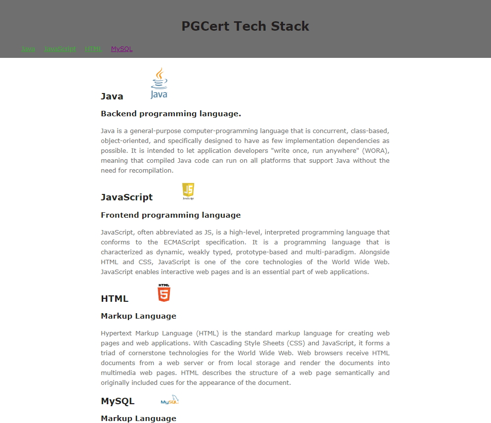

Web Lab 07 &ndash; JavaScript I
==========

Begin by forking this repository into your namespace by clicking the ```fork``` button above, then selecting your username from the resulting window. Once completed, click the ```clone``` button, copy the ```Clone with HTTPS``` value. Open IntelliJ, and from the welcome screen click ```Check out from Version Control -> Git```, then paste the copied URL into the ```URL``` field of the resulting window. Provide your GitLab username and password if prompted.

Explore the files in the project, familiarizing yourself with the content.

When complete, demonstrate your code to your tutor. This must be verified with your tutor by the end of the week.


Exercise One &ndash; Script Locations
----------

The goal of this exercise is to understand the order in which JavaScript will execute in the browser depending on where the scripts are placed.

Open `exercise01.html` and `exercise01.js`, inside the `ex01` folder. You'll see that a `<script>` tag is used to load the JS file between paragraphs four and five.

Looking at the JS file, we can see that it's supposed to count the number of `<p>` elements on the page, and display the information in the `#num-paras` `<div>`. Now load the webpage in your browser.

1. Is the information displayed correct? If it's not, why do you think this is so?
   ```text


   ```
   
2. Now, try moving the `<script>` tag to the page `<head>`, at the location marked *Alternative script position one*. Once this is done, reload the page in the browser. Is there any difference in the output? Why / why not?

   **Hint:** To help answer this question, you may also wish to check the browser console output to see if there are any error messages.
   
   ```text


   ```
   
3. Now, try moving the `<script>` tag to the bottom of the page, at the location marked *Alternative script position two*. Then, reload the page. What is the output now? Why?

   ```text


   ```
   
4. Let's say we want to include the `<script>` in the page's `<head>` (a good convention to follow), but we need to be able to count all `<p>` elements. Luckily, this is easy to achieve! To do so, follow these steps:

   a. Begin by moving the `<script>` tag back into the `<head>` (as you did in step 2).
   
   b. Now in your JavaScript file, create a `window.onload` event listener (`window.onload = function(){ ... }`).
   
   c. Now nest all of the code in the JavaScript file inside the `window.onload` event listener. 
   
   


Exercise Two &ndash; Changing Page Elements
----------
Open `exercise02.html` and `exercise02.js`, located in the `ex02` folder, and familiarize yourself with them. Write code inside the provided `changePage()` and `makeBold()` functions to accomplish the following tasks. You may **not** modify the HTML file in any way.

1. Make the first div pink.

2. Make the last paragraph element have red text.

3. Hide the 2nd div (`<div class="text2">`). **Hint:** Check out the `display` CSS attribute.

4. Change the text in the first paragraph to say "Hello World".

5. When you click on the button, make all paragraphs bold.

If you get stuck at any point during the above exercise, remember to check the browser console for errors.


Exercise Three &ndash; Displaying the Time
----------
Open `exercise03.html`, located in the `ex03` folder. You'll notice a span element: `<span id="the-time">`. Your goal for this exercise is to populate that span with the current time using JavaScript.

1. Create a new JavaScript file in the `ex03` folder. Call it `exercise03.js`. 

2. Create a `window.onload` event listener within your JavaScript file in which you can write the rest of your code. This will mean that all of the code will be able to access all DOM elements. 

3. Obtain a reference to the `<span>` from within your JS code.

4. Use the JavaScript `Date` object and methods to get a reasonable-looking representation of the time, and display it in the `<span>`.

   **Hint:** This might seem difficult, but if you read the appropriate documentation carefully and test your code thoroughly, you should be able to work out how to display the time properly. You should be able to show the hours, minutes, and even seconds properly. Some good references can be found here:
   - [JavaScript Date Object](https://developer.mozilla.org/en-US/docs/Web/JavaScript/Reference/Global_Objects/Date)
   
   **Note:** The `getTime()` method is **NOT** the correct method to use.
   
   
Exercise Four &ndash; A Shopping List
----------
In this exercise, we'll dynamically populate an HTML table using JavaScript.

Examine `exercise04.html`, and you'll see an empty `<tbody>`, which we'll be populating from JavaScript. Open `exercise04.js`, and you'll see an *array* named `shoppingList` has been declared, containing the information we wish to display in the table.

In the `createShoppingList()` function (which is setup to be called when the window loads), write a `for`-loop to appropriately iterate through the `shoppingList` array. For each entry in the shopping list, create a `<tr>` representing that entry. The `<tr>` should itself have two `<td>` child elements: the first displaying the *item* (e.g. Puppies), and the second displaying the amount of that item to purchase (e.g. 3).

Exercise Five &ndash; Content From JSON
-----------

In this exercise you will loop through an array of JSON objects to generate headings, paragraphs and images for divs on your page.

You will learn more about JSON in later lectures but for this lab exercise you will be reading from the JSON data.

You should check the reference information for JSON online:
- [JSON Reference](https://developer.mozilla.org/en-US/docs/Learn/JavaScript/Objects/JSON)

Also observe how the existing code in the `generateNavContent()` function accesses JSON content.  This should give you most of the syntax required to complete the next parts of the lab task.

Look at the `techStackInfo` variable to familiarise yourself**** with the content and structure of the data. 

When you finish your page should look like this:



Tasks:

Complete the `generateNavContent()` function in the `generate-content.js` JavaScript file:

1. Inside the for loop, append the navItem to the navList in the HTML document. The `generateNavContent()` function already has a constant that stores a reference to the `ul` element.
2. Check that the nav menu displays the correct text for all four items in the `techStackInfo` array and that the `href` attribute of each `anchor` element is set to `#` + the name of the the technology from the matching JSON object. This will mean that you can later link it to elements that have a matching id.  

For the next tasks you should look carefully at the image of the completed site to see what elements you should create.

Complete the `generateBodyContent()` function in the `generate-content.js` file:
1. Store a reference to the div element with the class 'container' in a 'const'/constant called container
2. Create a for loop to iterate through all JSON objects in the techStackInfo array, this will be similar to how the `generateNavContent()` function loops through all items in the techStackInfo array
3. Inside the loop: use `document.createElement( ... )` to create HTML elements for all necessary elements (divs, headings, subheadings, paragraphs and images). Look at the image of what the finished document should look like to decide what HTML elements you should create. Remember that you should create elements and store a reference to them in a variable. For example: `const  articleContainer = document.createElement("div");` . Storing a reference to an element will mean that you can use that reference later to append it to a parent element.
4. Inside the loop: Add the necessary text and attributes of all elements by retrieving information from the JSON objects when necessary
5. Inside the loop: Append all elements in the CORRECT ORDER from child to parent for them to display in the HTML document

Note: The images for exercise five are in the assets folder. Think carefully about how you set the `src` attribute for the img elements on your page. 